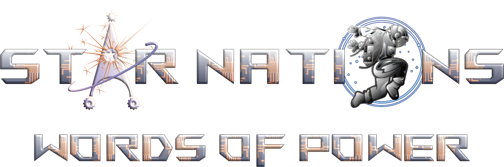
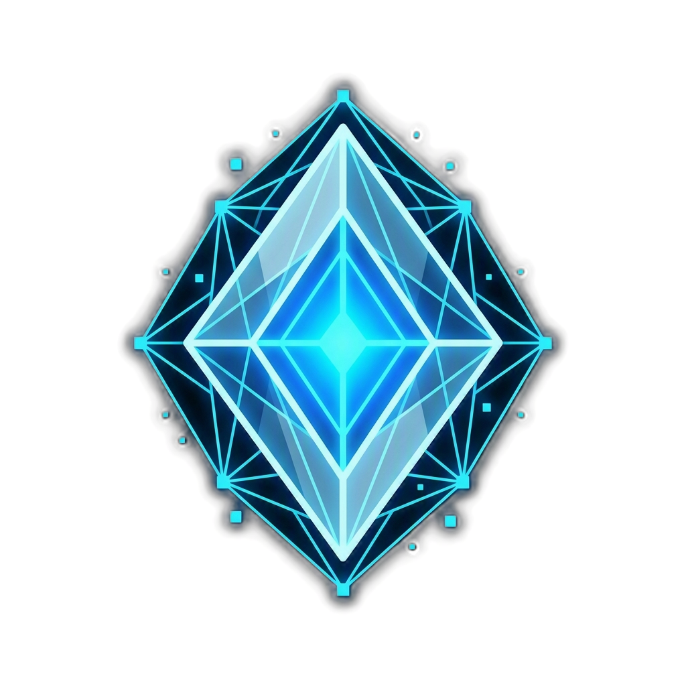
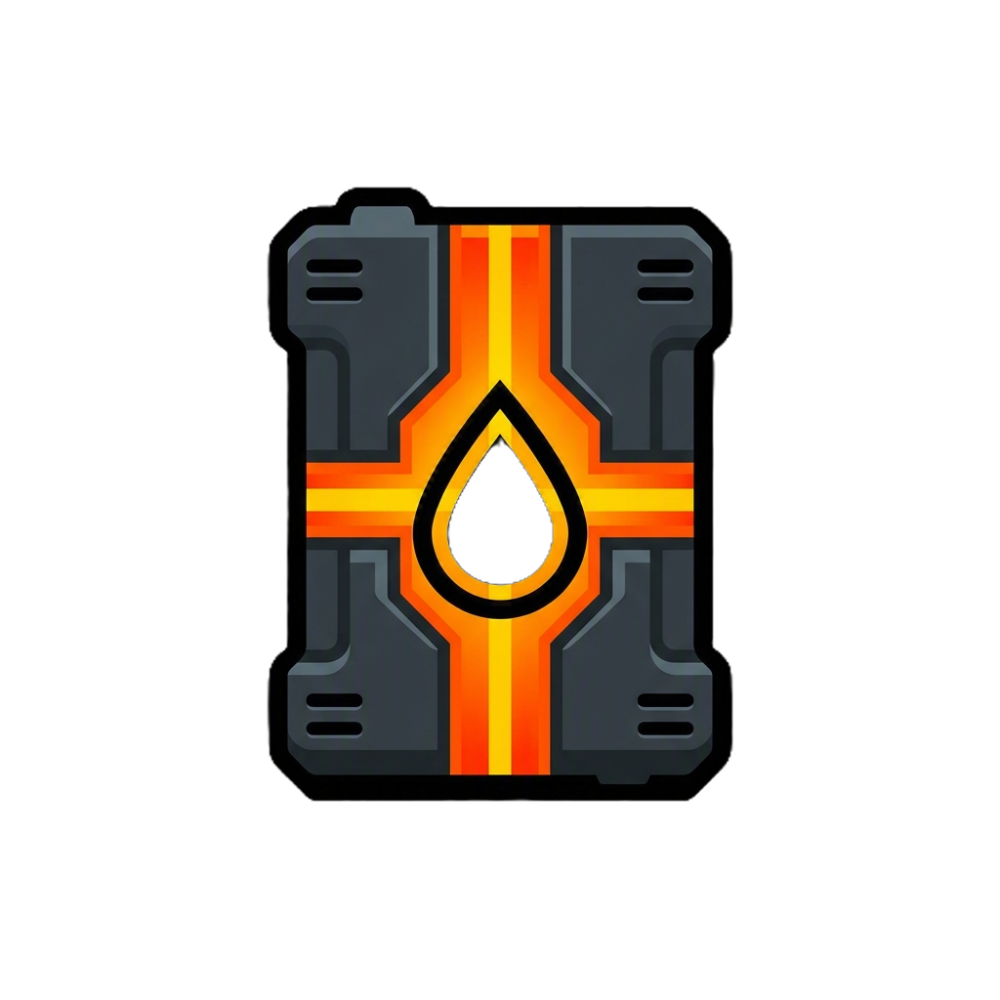
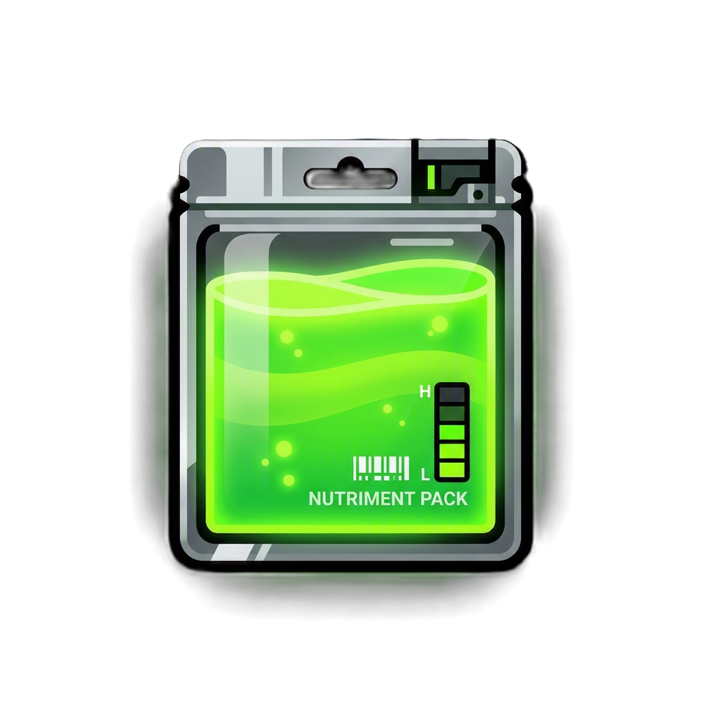

  

# The Next Era of Space Tactical Card Battles

Welcome to the official release hub for Alpha Version StarNations: Words of Power Compile your deck, lead your faction to victory, and conquer the galaxy system by system.

This repository hosts the official desktop client installers and auto-update assets.

---

## The World of Star Nations

Centuries ago, a cataclysmic event known as the **Great Collapse** tore through civilized space. Warp gates failed, communication networks fell silent, and entire star systems went dark. In its wake, humanity fractured into three competing factions, each determined to claim the scattered Star Nations—resource-rich systems left adrift in the void—and rebuild galactic civilization according to their own vision.

### The Arcanists
* **Tagline**: Masters of the Arcane, Wielders of Crystal Power
* **Leader**: Liana of the Myst (Archweaver Supreme)
* **Resource**:  Crystals
* **Identity**: Intellectual elites who channel magical energy through rare crystals to weave reality. They rely on combo-heavy spells (Weaves), mystical energy Sigils, and crystalline golems.
* **Quote**: *"Time, space, reality—all are threads in the great Weave. And I hold the needle."*

### The Technomancers
* **Tagline**: Engineers of Destiny, Masters of Machine
* **Leader**: Drago Techsmith (Forge Lord of the Iron Collective)
* **Resource**:  Oil
* **Identity**: Cold, calculating pragmatists who believe flesh fails and steel endures. They deploy armored mechanical constructs (Machineries) powered by oil extracted from industrial forge-worlds.
* **Quote**: *"You can't negotiate with entropy. You can only build stronger walls."*

### The Nomads
* **Tagline**: Wanderers of the Stars, Children of Fate
* **Leader**: Bianca Starfarer (The Wayfinder)
* **Resource**:  Food
* **Identity**: Adaptable star-wanderers who embrace fate and survival of the fittest. They use swarm tactics, gather food to grow their fleets, spend multiple resource types, and roll destiny dice to Evolve their units in battle.
* **Quote**: *"Fate rolls the dice, but we choose how to play the hand."*

## How to Play

### Board Layout & Zones
Matches take place on a shared tactical board. You must manage your zones and slots carefully:
* **The Board (Max 5 Slots)**: Houses your active **Creatures** and **Machineries**. These are your frontline combatants capable of attacking the enemy and blocking incoming strikes.
* **The Utility Zone (Max 4 Slots)**: Houses passive structures (**Utilities**) and face-down secret defenses (**Traps**) that trigger automatically when your opponent plays specific cards.
* **The Leader**: Your commander representing your life total (starts at 20 HP). If your leader's HP reaches 0, you lose. Leaders have unique active abilities that can be used once per turn.

### Turn Phases
Every turn progresses through a structured cycle:
1. **START**: Resolve upkeep effects and gain resources based on your caps (up to 10 max).
2. **DRAW**: Add the top card of your deck to your hand.
3. **PLAY**: Deploy units, place traps, cast spells (Weaves), or activate leader abilities.
4. **COMBAT**: Order your ready units to attack enemy units or the enemy leader.
5. **END**: Resolve end-of-turn passive triggers and pass the uplink to your opponent.

### Battle Rules & Keywords
Combat outcomes depend on your units' Attack (AP), Shield (SP), HP, and their special keywords:
* **GUARDIAN (Taunt)**: Frontline defenders. The enemy **must** target and destroy Guardian units before attacking your leader or other units.
* **STEALTH**: Hidden units. They cannot be targeted or attacked by the enemy until they perform an action.
* **EVOLVE (Nomad Special)**: Nomad units can roll a deterministic range of fate-dice to transform into a much stronger form with bonus stats.
* **BLITZ (Charge)**: Ready to strike. Blitz units can attack immediately on the turn they are summoned.
* **SHUTDOWN (Deathrattle)**: On-death triggers that fire immediately when the unit is destroyed and leaves the board.
* **CORROSION**: Poisonous damage that ticks at the end of each turn.

---

## Quick Install (Windows)

To install the desktop client on Windows, follow these simple steps:

1. Go to the **[Latest Release](https://github.com/AngelShade/StarNations-Releases/releases/latest)** page.
2. Under the **Assets** section, download the installer:
   - **🌐 `.exe` Installer** (Recommended): `StarNations.Planets.DLC_X.X.X_x64-setup.exe`
   - **📦 `.msi` Installer**: `StarNations.Planets.DLC_X.X.X_x64_en-US.msi`
3. Run the installer. It will configure the game and place a **StarNations Planets DLC** shortcut on your desktop!

---

## How Updates Work (Zero-Touch)

We use a fully automated, secure, and silent auto-updater. You never have to manually reinstall the game when new updates or card balance patches roll out:

* **Background Checks**: The game client automatically queries this repository for updates whenever you launch the game or exit a match back to the Main Menu.
* **Non-Intrusive**: Updates will **never** interrupt you or reboot the game while you are in the middle of a match or building a deck.
* **Instant Installation**: When an update is detected on the main menu, the screen will dim with a glowing uplink progress bar. The update downloads in the background, verifies its cryptographic security signature, and restarts the game in 10–15 seconds!
* **Offline Play Bypass**: If you have connection issues or GitHub is down, you can click the **PLAY OFFLINE** button on the update screen to bypass the check and play the current version instantly.

---

## System Requirements

* **Operating System**: Windows 10 or 11 (64-bit)
* **Processor**: Intel Core i3 or AMD equivalent
* **Memory**: 4 GB RAM
* **Storage**: 300 MB available space
* **Network**: Broadband Internet connection (for multiplayer matchmaking)

---

PS from Author: Go ingame and make it or break it while having fun.
Currently any bug reports would have to go thru this repo untill i get a discord server up and running
