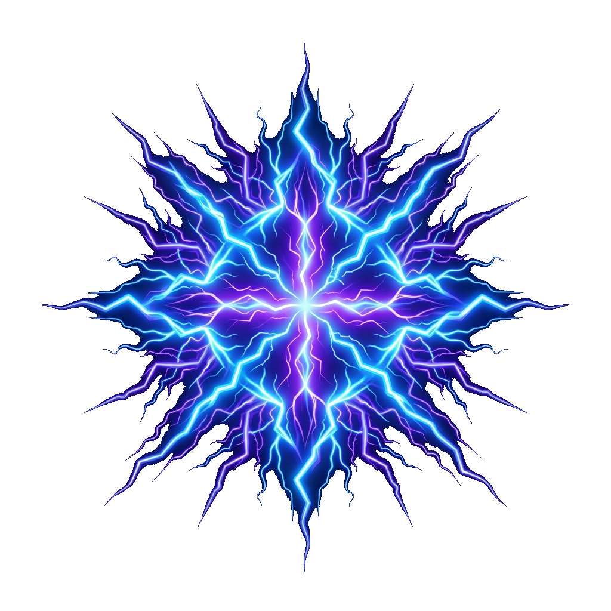
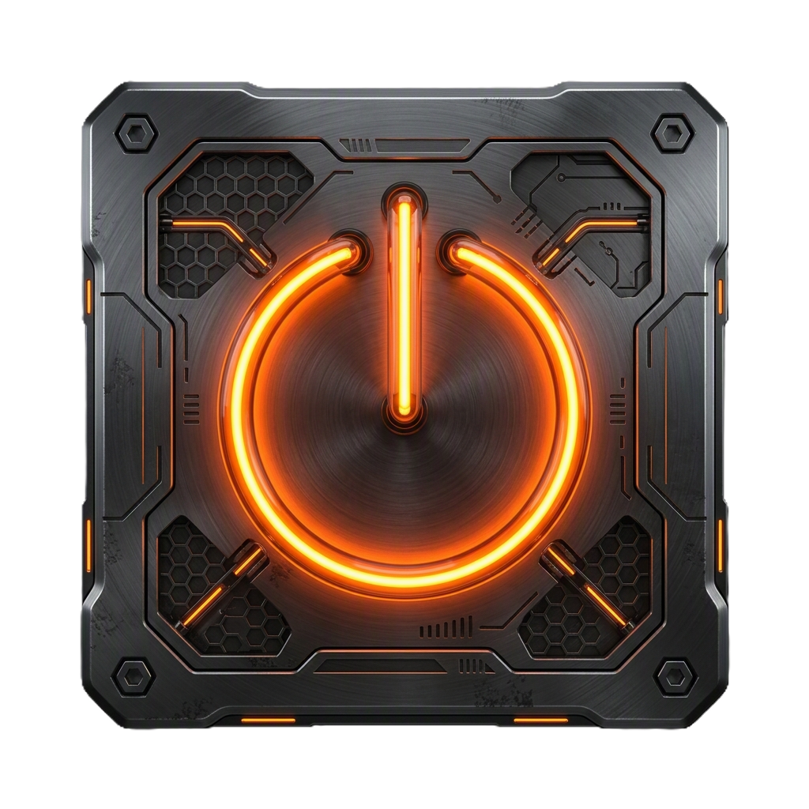
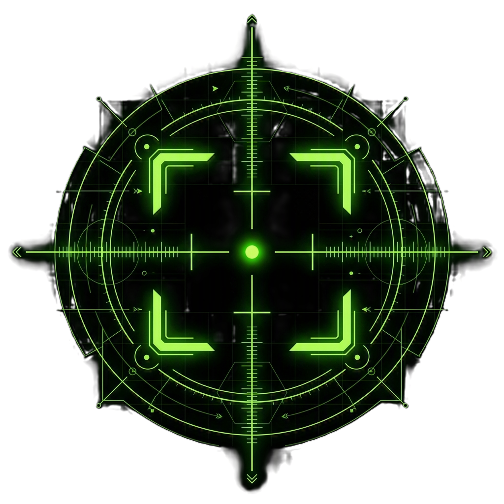

  

# 🌌 StarNations: Planets DLC
### *The Next Era of Space Tactical Card Battles*

Welcome to the official release hub for **StarNations: Planets DLC**! Compile your deck, lead your faction to victory, and conquer the galaxy system by system. 

This repository hosts the official desktop client installers and auto-update assets.

---

## 🚀 Quick Install (Windows)

To install the desktop client on Windows, follow these simple steps:

1. Go to the **[Latest Release](https://github.com/AngelShade/StarNations-Releases/releases/latest)** page.
2. Under the **Assets** section, download the installer:
   - **🌐 `.exe` Installer** (Recommended): `StarNations.Planets.DLC_X.X.X_x64-setup.exe`
   - **📦 `.msi` Installer**: `StarNations.Planets.DLC_X.X.X_x64_en-US.msi`
3. Run the installer. It will configure the game and place a **StarNations Planets DLC** shortcut on your desktop!

---

## ⚡ How Updates Work (Zero-Touch)

We use a fully automated, secure, and silent auto-updater. You never have to manually reinstall the game when new updates or card balance patches roll out:

* **Background Checks**: The game client automatically queries this repository for updates whenever you launch the game or exit a match back to the Main Menu.
* **Non-Intrusive**: Updates will **never** interrupt you or reboot the game while you are in the middle of a match or building a deck.
* **Instant Installation**: When an update is detected on the main menu, the screen will dim with a glowing uplink progress bar. The update downloads in the background, verifies its cryptographic security signature, and restarts the game in 10–15 seconds!
* **Offline Play Bypass**: If you have connection issues or GitHub is down, you can click the **PLAY OFFLINE** button on the update screen to bypass the check and play the current version instantly.

---

## 🎮 How to Play

### 🌌 Factions & Resource System
StarNations features three distinct space-faring factions, each relying on a specific resource type to deploy units and cast weaves (spells):

| Faction | Resource Type | Focus / Style |
|:---|:---|:---|
| **🔮  Arcanists** |  Crystals | Spell weaving, card manipulation, and dynamic weaves. |
| **⚙️  Technomancers** |  Oil | Machinery constructs, high shield defenses, and automation. |
| **⛺  Nomads** |  Food | Swarm tactics, high mobility, and multi-resource versatility. |

### ⚔️ Game Flow & Phases
Matches take place in real-time turn phases. Manage your board slots carefully:
1. **START / DRAW**: Replenish your hand and gain resources.
2. **PLAY**: Deploy Creatures, Machineries, or cast Weaves.
3. **COMBAT**: Target enemy structures or creatures. Guardian units must be attacked first!
4. **END**: Resolve end-of-turn passive triggers and pass the uplink to your opponent.

---

## 📝 System Requirements

* **Operating System**: Windows 10 or 11 (64-bit)
* **Processor**: Intel Core i3 or AMD equivalent
* **Memory**: 4 GB RAM
* **Storage**: 300 MB available space
* **Network**: Broadband Internet connection (for multiplayer matchmaking)

---

*StarNations: Planets DLC is built using React 19 + TypeScript + Vite + Tailwind CSS 4 and packaged natively using Tauri v2.*
